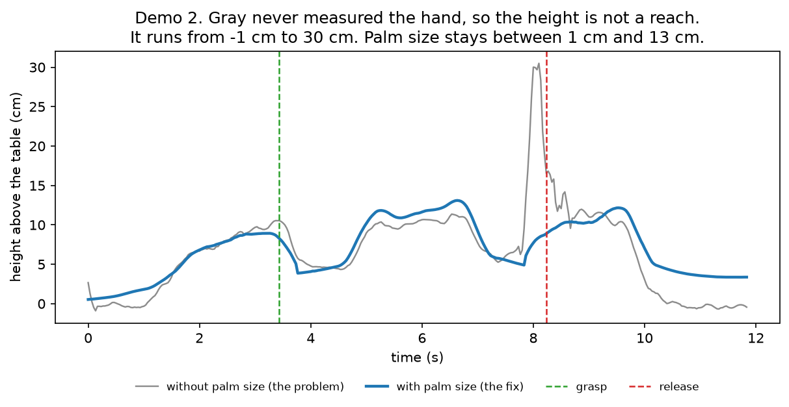
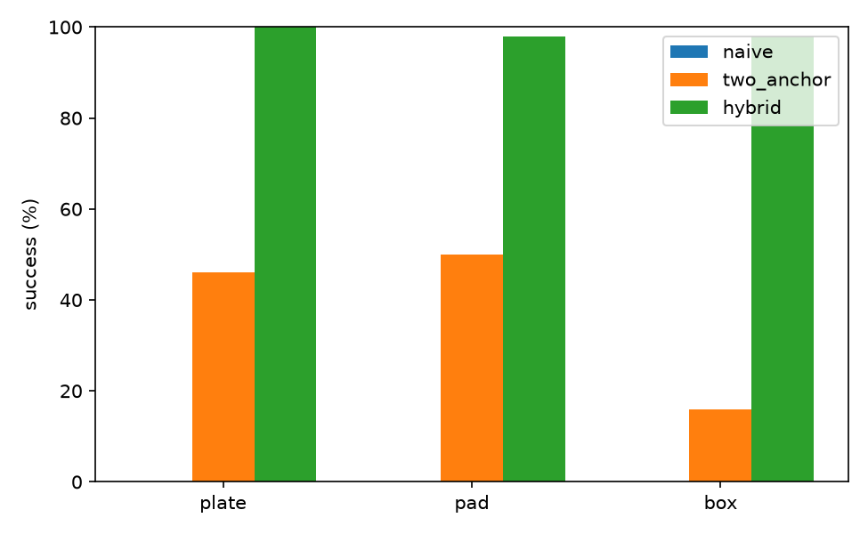
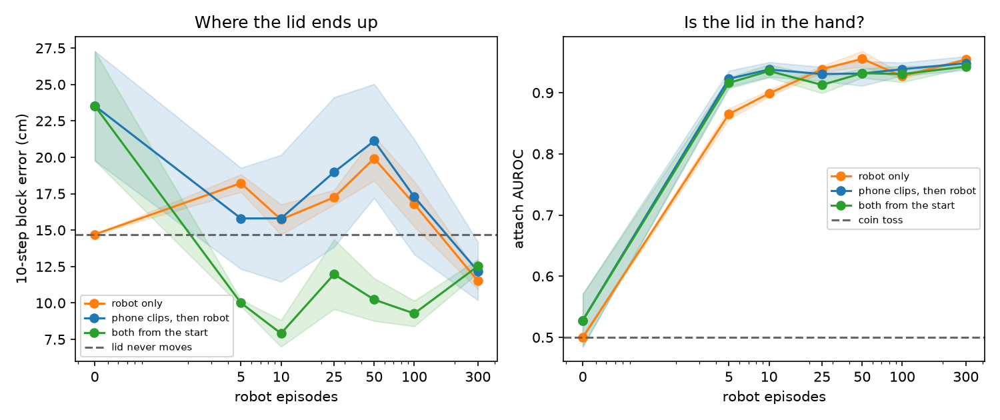
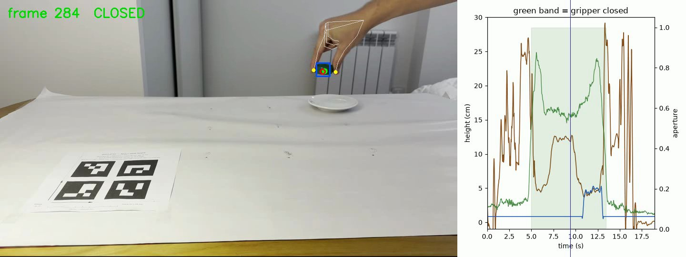
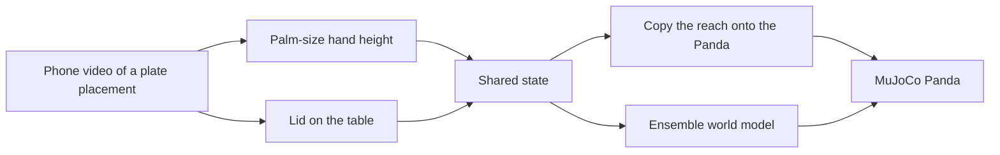

# palm-prior

Forty-five phone clips of one hand putting a lid on a plate, turned into a state a simulated Franka Panda can use.

The numbers are in [RESULTS.md](RESULTS.md). Equations and file formats are in [docs/EXPLAINER.md](docs/EXPLAINER.md). How the clips were filmed is in [docs/FILMING_GUIDE.md](docs/FILMING_GUIDE.md).

## Setup

CPU only. Python 3.11, with [uv](https://docs.astral.sh/uv/). macOS, Linux and Windows.

macOS and Linux:

```bash
curl -LsSf https://astral.sh/uv/install.sh | sh
uv sync --extra dev
```

Windows (PowerShell):

```powershell
powershell -ExecutionPolicy ByPass -c "irm https://astral.sh/uv/install.ps1 | iex"
uv sync --extra dev
```

On Linux, uv takes the CPU build of PyTorch. The published numbers are already in `results/v2/`. To check the install without the phone videos:

```bash
uv run pytest
uv run python scripts/smoke_mujoco.py overwrite=true
```

`pytest` checks the state, the palm-size fit, the retarget, the IK, and CEM on a quadratic. `smoke_mujoco.py` renders the Panda and writes `results/smoke.png`. Rebuilding the tables is `uv run python scripts/fix_all.py`. On the machine that produced these numbers that was about three quarters of an hour, and it skips clips already in `results/v2/clips/`. It does not replace `RESULTS.md`.

Five clips are in the repo so a reviewer can see the camera, the table, a success, a miss and a drop: `data/raw/calib.mp4`, `empty.mp4`, `demo_001.mp4`, `demo_031.mp4`, `demo_035.mp4`. The other 42 stay local. `calib.mp4` is 52 MB, so the push warns and still goes through. Labels are in `data/raw/recording_log.csv`, not in the filenames. Every row has `goal=plate`.

The first extraction downloads the MediaPipe hand model into `third_party/hand_landmarker.task` from the URL in `src/palm_prior/perception/hand.py`. The first MuJoCo run downloads the Menagerie Panda into `~/.cache/robot_descriptions`. On macOS the interactive viewer needs `mjpython`. The offscreen renderer used here runs under `python` on macOS, Windows and Linux. MediaPipe 1.x crashes in the hand landmarker on macOS, so the pin is `mediapipe>=0.10.14,<1.0`.

## The height was wrong. Measuring the hand fixed the trace

A single camera sees the fingers in the image and does not see their distance. The first estimate used a generic hand and none of the lengths measured on this hand.

### Demo 2. Finger height before and after measuring the hand

This is one success clip, `demo_002.mp4`, a high reach onto a plate. Time runs left to right. The vertical lines mark the grasp and the release. Gray is the old height, with no palm measurement: it runs from −1 cm to 30 cm, and the spike to 30 cm is at the release. Blue is the same frames after fitting the eight measured lengths on the back of the hand. That reach stays between 1 cm and 13 cm, about 8 cm at the grasp and 9 cm at the release.



## What that changed

Every clip aims the lid at a plate. The pad and the box exist only in the simulator. The arm is tested by replaying one plate video in three ways. The names below are the labels on the next figure.

**Naive.** One map, built once from clip 1 and a single plate layout, then reused on every layout. It never looks at where the lid and the target are on that try.

**Two-anchor.** For each layout, the grasp in the video is sent to the lid and the release is sent to the target. Those two points fix the whole path, and the height is still the height from the video.

**Hybrid.** The same two pins across the table. The height of the grasp comes from the lid, and the height of the release comes from the target. A smooth curve joins them, so the gripper arrives stopped. While the fingers close and lift, the gripper stays over the lid. While they open, it stays over the target.

| | Result |
|---|---|
| Naive | 0/150 |
| Two-anchor | 56/150. Plate 23/50, pad 25/50, box 8/50 |
| Hybrid | **148/150.** Plate 50/50, pad 49/50, box 49/50 |
| Predict the lid, clips plus 10 robot tries | **7.9 cm**. The same 10 tries alone are 15.7 cm. "The lid never moves" is 14.7 cm |
| Clips alone, no robot tries | 23.5 cm, worse than guessing the lid stays still |

### Where the copied reach lands

Each bar is a success rate: the lid finished within 3 cm of the target, at the right height, with the fingers open. There are 50 layouts on a plate, 50 on a pad, and 50 on a box. The videos are all plate placements. The pad and the box are simulator targets the hand never touched. Naive is absent from the top of the chart because it lands on none of them. Hybrid is the right-hand bar in each group.



### Whether the clips make the prediction better

Two panels, same horizontal axis: how many robot tries the model was trained on. The left panel is how many centimetres the model is wrong about where the lid will be, about one second ahead. Lower is better. The dashed line is the guess that the lid never moves. The right panel is whether the model can tell that the lid is in the hand. A score of 0.5 is a coin toss, and 1 is perfect. The band around each line is the spread across three training starts.



### One frame of clip 1, while the lid is in the air

This is a single frame of the extraction preview, not a graph. White lines are the hand. The green dot is the pinch in the image. The red circle is that pinch estimated in centimetres and drawn back onto the frame. The blue box is the lid. The plate is to the right. The full preview is [results/extract_demo_001.mp4](results/extract_demo_001.mp4).



## How it works



**Hand height.** Eight measured segments on the back of the hand are fitted to the knuckles. A scale lines that fit up with the lid at the grasp and at the release. The gray line in the figure is the previous estimate, which never used those lengths.

**Copying the reach.** Hybrid, above, takes its timing from the video. The grasp is pinned to the lid and the release to the target. Near those two moments the height comes from the object, and a minimum-jerk curve joins them so the gripper arrives stopped. Two points still fix the horizontal map,

$$
T(x) = \alpha x + \beta,\quad
\alpha = \frac{P - G}{x_r - x_g},\quad
\beta = G - \alpha x_g.
$$

Worked check, in `tests/test_retarget.py`: $x_g = (0.10, 0.05)$, $x_r = (0.30, 0.15)$, lid $G = (0.50, 0.10)$, target $P = (0.60, -0.12)$ give $\alpha = -0.04 - 1.08i$ and $\beta = 0.45 + 0.21i$.

**State.** The same vector is written for the hand and for the gripper. v2 appends the target position, which stays constant inside a clip:

$$
s = [\,d_{eo},\; d_{to},\; z_{obj},\; h_{tgt},\; g,\; p_{tgt}\,],\quad
d_{eo} = p_{ee} - p_{obj},\quad
d_{to} = p_{tgt}^{xy} - p_{obj}^{xy}.
$$

That is 11 numbers. The action is the change in finger position plus the next grip, at 10 Hz. Built only through `src/palm_prior/state.py`.

**World model.** Five small networks. Input is the 11 numbers, the action, and a bit that says hand or robot. Output is how the lid moves, and whether it is held. Trained three ways: robot tries only, clips first then robot, or both from the start. The recipe that works at a small budget is both from the start.

**Simulator.** Plain MuJoCo and the Menagerie `franka_emika_panda`. The scene is `assets/scene.xml`. The gripper tendon is `actuator8`, 255 open and 0 closed. There are no sites in that model. The tool centre is injected at hand-local `[0, 0, 0.1034]`. The filmed lid is 1.7 cm tall. The simulated block is a 4 cm cube, because a 1.7 cm cube cannot be pinched by this gripper. The fingers count as open when the thumb and index are together, and closed when the lid spreads them.

Closed-loop planning was not run.

## Layout

```
configs/default.yaml     every parameter, including the eight hand lengths
src/palm_prior/           perception, vision, retarget, sim, world model
scripts/fix_all.py        the run that writes results/v2/
assets/scene.xml          table, block, plate, pad, box
results/v2/               the numbers in RESULTS.md
results/v1/               the 7 October run
docs/EXPLAINER.md         equations and formats
```

`data/human/`, `data/robot/`, `checkpoints/`, `.venv/` and `third_party/` are gitignored, as are the phone videos other than the five named above.

License: MIT. Copyright Luc Mantoux.
