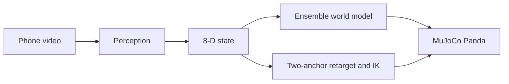

# palm-prior

Phone clips of a hand moving a lid, turned into a state a simulated Franka Panda can use.

The numbers are in [RESULTS.md](RESULTS.md). The equations, frames and file formats are in [docs/EXPLAINER.md](docs/EXPLAINER.md). How the clips were filmed is in [docs/FILMING_GUIDE.md](docs/FILMING_GUIDE.md).

## Part 1 – How to use it

CPU only. Python 3.11, installed with [uv](https://docs.astral.sh/uv/). macOS, Linux and Windows.

### Install

macOS and Linux:

```bash
curl -LsSf https://astral.sh/uv/install.sh | sh
uv sync --extra dev
```

Windows (PowerShell):

```powershell
powershell -ExecutionPolicy ByPass -c "irm https://astral.sh/uv/install.ps1 | iex"
uv sync --extra dev
```

On Linux, uv takes the CPU build of PyTorch from the PyTorch index. The Windows and macOS wheels on PyPI are already CPU-only. The first MuJoCo run downloads the Menagerie Panda into `~/.cache/robot_descriptions`. The first extraction downloads the MediaPipe hand model into `third_party/hand_landmarker.task`. Both need a network once.

### Where the phone videos go

Put them in `data/raw/`:

| File | What it is |
|---|---|
| `calib.mp4` | checkerboard, held in the hand, moved slowly |
| `empty.mp4` | the empty table, phone still |
| `demo_001.mp4` … `demo_045.mp4` | the 45 clips, in the order of `data/raw/recording_log.csv` |

If the phone named the files differently, add `data/raw/clip_files.csv` with columns `clip,filename`. When that file is absent, the scripts look up `demo_<clip>.mp4`. This session has no `clip_files.csv`.

`data/raw/dots.yaml` is the planned pencil-mark layout. `data/raw/recording_log.csv` is which clip starts on which dot. Both are in the repo.

### Pipeline

Each command prints its runtime. Times in the last column were printed on an Apple M2 Pro during the run that produced [RESULTS.md](RESULTS.md). They are a guide.

| Order | Command | Writes | About |
|---|---|---|---|
| 1 | `uv run python scripts/make_board.py` | `results/print/board.pdf`, `results/print/setup_schematic.png` | a few seconds |
| 2 | `uv run python scripts/smoke_mujoco.py` | `results/smoke.png` | a few seconds |
| 3 | `uv run python scripts/calibrate.py` | `data/calib/camera.yaml`, `results/calib_check.png` | 1 minute |
| 4 | `uv run python scripts/debug_aruco.py video=data/raw/empty.mp4` | `results/debug_aruco_empty.mp4` | seconds |
| 5 | `uv run python scripts/preview_hand.py clip=1` | `results/preview_hand_demo_001.mp4`. If `data/calib/block_hsv.yaml` is missing it opens a window and asks for one click on the lid | the length of the clip |
| 6 | `uv run python scripts/extract_human.py` | `data/human/clip_*.npz`, `data/human/transitions.npz`, `results/extraction_report.csv`, `results/extract_demo_*.mp4` | 10 minutes |
| 7 | `uv run python scripts/plot_retarget.py` | `results/retarget_top.png` | under a second |
| 8 | `uv run python scripts/replay.py` | `results/e1.csv`, `results/e1_plate.mp4`, `results/e1_pad.mp4`, `results/e1_box.mp4` | 4 minutes |
| 9 | `uv run python scripts/generate_robot.py` | `data/robot/episodes.npz` | 3 minutes |
| 10 | `uv run python scripts/exp_e2.py` | `results/e2.csv`, `results/e2_curve.png`, `checkpoints/` | 30 minutes |
| 11 | `uv run python scripts/fig_gap_heatmap.py` | `results/gap_heatmap.png` | a few seconds |
| 12 | `uv run python scripts/fig_human_overlay.py` | `results/human_overlay_clip008.mp4` | a few seconds |
| 13 | `uv run python scripts/scripted_check.py` | `results/scripted_check.csv`, `results/scripted_check_{plate,pad,box}.mp4` | a few minutes |
| 14 | `uv run python scripts/summarise_results.py` | `RESULTS.md`, `results/photographed_dots.csv` | under a second |

A finished output is skipped. Pass `overwrite=true` to redo it. `exp_e2.py` reuses `checkpoints/_human_pretrain_seed*.pt` if they exist. Delete `checkpoints/` before a new E2 when the human transitions have changed.

### Quick demo, no phone videos

These three do not read `data/raw`:

```bash
uv run pytest
uv run python scripts/smoke_mujoco.py overwrite=true
uv run python scripts/scripted_check.py scripted.n_seeds=1 overwrite=true
```

`pytest` checks the state, the two-anchor map, the IK, and CEM on a quadratic. `smoke_mujoco.py` renders the Panda and writes `results/smoke.png`. `scripted_check.py` picks the block up with a script that is told the positions. `scripted.n_seeds=1` is one layout per goal. The committed `results/scripted_check.csv` is ten layouts; do not pass `overwrite=true` on that command if you want to keep it.

The retargeting replay, the extraction, and the world-model curve need the videos or the extracted `data/human/` files. Those directories are gitignored.

## Part 2 – What this is

The challenge asks for real data collected by the applicant, used to drive a manipulator in a simple simulator, with a VLA or a world model. The suggested picture is an egocentric hand clip driving a Panda in Libero.

The question here is narrower. Do 45 clips of my hand moving a lid, 30 successes and 15 deliberate failures, teach a model where the lid goes, in a state a Panda can share? Two claims were measured. Pinning a copied reach to the lid and to the target beats one fixed map. A predictor pretrained on the clips does not beat the guess that the lid stays still. The attach bit, "is the lid in the hand", does learn. Closed-loop control was not run.

### Architecture



Perception reads the board, the hand and the lid. The state is the hand relative to the lid, the lid relative to the target, the lid height, the target height, and whether the pinch is closed. The world model predicts how the lid moves and whether it is attached. Retargeting copies a hand path onto the robot so the grasp and the release land on the objects in the simulator. Inverse kinematics turns that path into Panda joint motion.

### Components

Full derivations are in [docs/EXPLAINER.md](docs/EXPLAINER.md). What follows is the input, the output, the equation, and one example for each piece.

**Perception.** Input: a frame, the camera matrix, the ArUco board. Output: the table pose, 21 hand landmarks, the lid centre in the table frame. The board is one static pose per clip: the median translation and the mean rotation. The lid is the green blob in the HSV range in `data/calib/block_hsv.yaml`. Worked check: calibration must finish under 0.5 px RMS (`configs/default.yaml`, `calib.max_rms_px`). The value for this camera is in `data/calib/camera.yaml`.

**State.** Input: end-effector position, lid position, target position and height, gripper bit. Output: \(s \in \mathbb{R}^8\),

\[
s = [\,d_{eo},\; d_{to},\; z_{obj},\; h_{tgt},\; g\,],\quad
d_{eo} = p_{ee} - p_{obj},\quad
d_{to} = p_{tgt}^{xy} - p_{obj}^{xy}.
\]

The action is \(a = [\,p_{ee}(t{+}1) - p_{ee}(t),\; g(t{+}1)\,]\) at 10 Hz. Given a predicted lid motion \(\Delta\hat p_{obj}\),

\[
d_{eo}' = d_{eo} + a_{xyz} - \Delta\hat p_{obj},\quad
d_{to}' = d_{to} - \Delta\hat p_{obj}^{xy},\quad
z_{obj}' = z_{obj} + \Delta\hat p_{obj}^{z}.
\]

Example from the explainer: hand 1 cm above a 4 cm block, pinch closed, target 15 cm in x and 5 cm in y, plate goal, action lifts 2 cm. \(s = [0,0,0.01,\; 0.15,0.05,\; 0.02,\; 0.015,\; 1]\), \(a = [0,0,0.02,1]\). If the lid comes up by 1.9 cm, \(s' = [0,0,0.011,\; 0.15,0.05,\; 0.039,\; 0.015,\; 1]\). Built only through `src/palm_prior/state.py`.

**World model.** Input: standardised \(s\), standardised \(a\), and an embodiment flag, 13 numbers. Output: \(\Delta\hat p_{obj}\) in metres and one attach logit. Five MLPs, each 13 → 128 → 128 → 128 → 4, SiLU. Loss is a 5-step self-rollout: mean squared error on the lid motion plus 0.5 times binary cross-entropy on the attach bit. Adam, learning rate \(10^{-3}\), batch 256, 3000 pretraining steps, then 1500 fine-tuning steps at 0.3 times the learning rate with 20% human batches. Example: the N = 0 phone-clip model in [RESULTS.md](RESULTS.md) has a 10-step position error of 17.92 ± 2.10 cm, against 11.67 cm for "the lid never moves."

**Retarget and IK.** Input: a hand path and two pairs of points, grasp and release. Output: a gripper path in the simulator, then 7 joint commands. Two points fix a similarity,

\[
T(x) = \alpha x + \beta,\quad
\alpha = \frac{P - G}{x_r - x_g},\quad
\beta = G - \alpha x_g,\quad
\kappa = \mathrm{clip}(|\alpha|, 0.5, 1.5).
\]

Example from the explainer, checked in `tests/test_retarget.py`: \(x_g = (0.10, 0.05)\), \(x_r = (0.30, 0.15)\), block \(G = (0.50, 0.10)\), target \(P = (0.60, -0.12)\) give \(\alpha = -0.04 - 1.08i\) and \(\beta = 0.45 + 0.21i\). \(T(x_r) = P\). Joint motion is damped least squares, \(\lambda = 0.05\),

\[
\Delta q = J^\top (JJ^\top + \lambda^2 I)^{-1} e.
\]

**Simulator.** Input: a joint command and a gripper command. Output: the next 8-D state, from the MuJoCo Panda. The scene is `assets/scene.xml`. The arm is the Menagerie `franka_emika_panda`, loaded by `robot_descriptions`. The gripper tendon is `actuator8`, 255 open and 0 closed. There are no sites in that model; the tool centre is injected at hand-local `[0, 0, 0.1034]`.

### Tech

MuJoCo and the Menagerie Franka Panda. MediaPipe Tasks for the hand. OpenCV for the checkerboard and the ArUco board (`DICT_4X4_50`). PyTorch on CPU for the ensemble. uv for the environment.

### What I added

The 45 clips, filmed on one phone, including misses, drops, short placements and pushes. The 8-D state that a hand and a gripper both write. Two-anchor retargeting, measured against one fixed map. The human-pretrained ensemble, measured against "the lid never moves" and against a model trained on robot episodes alone. The evaluation: open-loop replay on 50 layouts, a data-efficiency curve at seven dataset sizes and three seeds, an attach AUROC, a grasp-offset heatmap, and a roll-out drawn back onto a held-out clip.

### Design choices

The simulator is plain MuJoCo. The brief's example is Libero, which depends on robosuite and is awkward on Windows and on a CPU-only machine. The arm in the brief's screenshot is a Franka Panda, and Libero runs on MuJoCo, so the scene here is a Panda scene I can read.

The camera is on a tripod, facing the table. The brief's example is egocentric. A fixed camera and a printed board give one intrinsic matrix and a known plane, which is what turns pixels into centimetres.

Training is on a laptop CPU. The ensemble is about 35k parameters per member. A 450M-parameter VLA needs a GPU, and this project does not use one.

Four choices differ from [docs/EXPLAINER.md](docs/EXPLAINER.md) and are stated here so the code and the note do not disagree.

The target used in the state is the photographed pencil mark: the median opening lid, over the first 2 seconds, of the clips that start on that dot. `data/raw/dots.yaml` is the plan that was printed. The tape sits toward the chair from that file. The 2 cm gate compares each opening to the photographed mark. See `apply_photographed_dots` in `scripts/extract_human.py`.

The pinch is open when the thumb and index are together. Holding the lid spreads them. `gripper_signal` treats the rest-period median as open and a departure from it as closed. A push, which spreads the fingers without a lift, can therefore count as several grasps.

The filmed lid is 1.7 cm tall (`objects.block_size`). The simulated block is a 4 cm cube (`objects.sim_block_size`), because a 1.7 cm cube cannot be pinched by this gripper. The plate radius is 5.85 cm, from an 11.7 cm plate.

The replay closes the gripper at the block centre. The measured pinch height on these clips is not used for that close. The E2 score uses the 10-step window in which the block travels farthest, because the approach does not move the block.

### Headline results

Computed by `scripts/summarise_results.py` from the files in `results/`. The claims, the baselines and the seeds are in [RESULTS.md](RESULTS.md).

| | Result | Compared with |
|---|---|---|
| Clips through QC | 36/45 | the rules in `results/extraction_report.csv` |
| Two-anchor replay | 20/150, median miss 12.3 cm | fixed map, 0/150, median miss 23.2 cm |
| Scripted pick, positions given | 9/10 plate, 10/10 pad, 10/10 box | the same success rule |
| Phone clips, then robot data, N = 0 | 17.92 ± 2.10 cm | "the lid never moves", 11.67 cm |
| Attach, same recipe, N = 0 to N = 25 | 0.81 ± 0.02 to 0.95 ± 0.00 | a coin toss at 0.50 |

Closed-loop MPC was not run. A training ablation that drops the failure clips was not run.

## Layout

```
configs/default.yaml          every parameter
src/palm_prior/               perception, human, retarget, sim, wm, plan
scripts/                      one script per step
assets/scene.xml              the table, the block, the three goals
tests/                        state, geometry, retarget, IK, CEM, extraction
results/                      csv, png, mp4
docs/EXPLAINER.md             equations and formats
docs/FILMING_GUIDE.md         how the clips were filmed
```

`data/raw/*.mp4`, `data/human/`, `data/robot/`, `checkpoints/`, `.venv/` and `third_party/` are gitignored.

License: MIT. Copyright Luc Mantoux.
