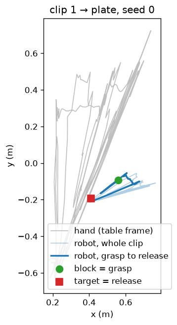
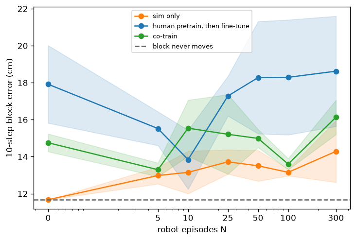
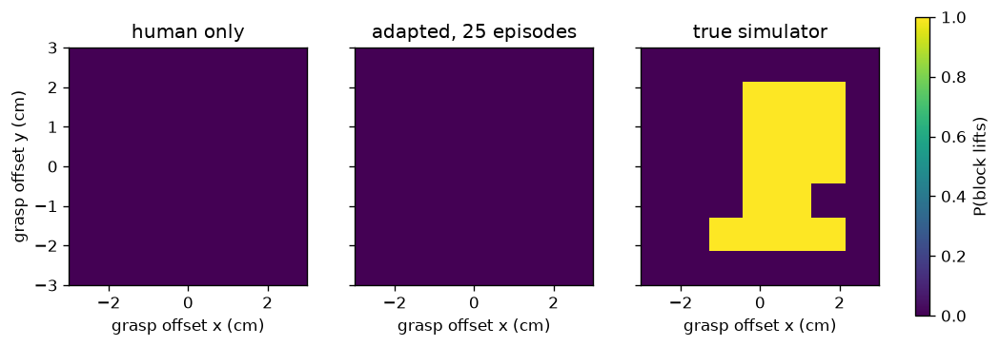

# Results

Generated by `scripts/summarise_results.py`. Every number below is computed
from the file named in that section. Re-run the script after an experiment;
do not edit the tables.

The question is whether 45 phone clips of a hand moving a lid make a
simulated Franka Panda any better at knowing where the lid goes. The
answer is split. Pinning a copied reach to the lid and to the target
beats one fixed stretch. A predictor trained on the clips does not beat
the guess "the lid stays still."

## Data QC

Source: `results/extraction_report.csv`. A clip passes when the hand and
the lid are found on at least 90% of frames, the reprojected pinch is
within 15 px on the median frame, the opening lid is within 2 cm of the
photographed pencil mark, and the grasp count matches the clip type
(one grasp, or zero for a push).

| Type | Clips | Passed |
|---|---:|---:|
| success | 30 | 29 |
| F1 | 4 | 0 |
| F2 | 4 | 3 |
| F3 | 4 | 4 |
| F4 | 3 | 0 |
| all | 45 | 36 |

Median opening error against the photographed mark: 0.72 cm.
Largest: 1.73 cm. Limit: 2 cm.

The photographed mark is the median opening lid of the clips that start
on that dot, not the coordinate in `data/raw/dots.yaml`. The tape sits
toward the chair from the file. Source of the comparison:
`results/photographed_dots.csv`, written by this script from
`data/human/clip_*.npz` when those files are present.

| Dot | Photographed (cm) | Plan (cm) | Toward the chair (cm) |
|---:|---|---|---:|
| 1 | 21.5, 42.0 | 22, 40 | 2.0 |
| 2 | 35.8, 43.6 | 37, 40 | 3.6 |
| 3 | 51.4, 43.7 | 52, 40 | 3.7 |
| 4 | 22.1, 28.9 | 22, 25 | 3.9 |
| 5 | 37.2, 29.3 | 37, 25 | 4.3 |
| 6 | 52.4, 30.4 | 52, 25 | 5.4 |
| 7 | 22.1, 14.8 | 22, 10 | 4.8 |
| 8 | 36.9, 14.0 | 37, 10 | 4.0 |
| 9 | 51.9, 15.8 | 52, 10 | 5.8 |

Source: `results/photographed_dots.csv`.

Median fraction of frames with a hand: 1.000.
Median fraction of frames with a lid: 1.000.
Source: `results/extraction_report.csv`, columns `valid_hand` and
`valid_block`. The red dot in
`results/extract_demo_001.mp4` is the 3-D pinch drawn back onto the
photo. The green dot is the pinch measured in the image. They are the
same point. The check uses the median frame, so a clip can pass while
the red dot leaves the fingers on other frames. Example previews:
`results/extract_demo_001.mp4` (success), `results/extract_demo_031.mp4`
(miss), `results/extract_demo_035.mp4` (drop).

## E1 retargeting

Source: `results/e1.csv`. Seeds 0–49, three goals, one QC-passed success
clip per episode. Success: lid centre within 3 cm of the target in xy,
at the right height, gripper open, speed under 1 cm/s. The baseline is
one similarity fit on clip 1 and the seed-0 plate, reused on every layout.
Two-anchor refits that similarity so the grasp lands on this lid and the
release lands on this target.

| Method | plate | pad | box | all | median miss (cm) |
|---|---:|---:|---:|---:|---:|
| naive | 0/50 | 0/50 | 0/50 | 0/150 | 23.2 |
| two_anchor | 7/50 | 8/50 | 5/50 | 20/150 | 12.3 |

Claim: pinning both ends beats a fixed map. The metric is successes out
of 150. The baseline is `naive`. Variance is the spread of layouts, not
of training seeds: one deterministic replay per layout. The evidence is
the table. A miss distance is in `xy_err_m`.

Side-by-side videos: `results/e1_plate.mp4`, `results/e1_pad.mp4`,
`results/e1_box.mp4`.

A scripted pick that is told the positions and does not watch the clips
is the reference for 'the simulator can do the task'. Source:
`results/scripted_check.csv`.

| Goal | Successes |
|---|---:|
| plate | 9/10 |
| pad | 10/10 |
| box | 10/10 |

## E2 world-model data efficiency

Source: `results/e2.csv`. Three recipes, N robot episodes, three seeds.
The metric is the 10-step block-position error, in centimetres, on
held-out robot episodes (seeds 900–999), on the 10-step window where the
block travels farthest. The baseline is `sim_only` at N = 0, which is
the error of predicting that the block never moves. Lower is better.
Each cell is the mean ± the standard deviation of the three seeds.

| N | Robot data only | Phone clips, then robot data | Both from the start |
|---:|---:|---:|---:|
| 0 | 11.67 ± 0.00 | 17.92 ± 2.10 | 14.75 ± 0.48 |
| 5 | 12.98 ± 0.45 | 15.52 ± 0.91 | 13.30 ± 0.37 |
| 10 | 13.15 ± 1.15 | 13.84 ± 1.60 | 15.54 ± 1.52 |
| 25 | 13.72 ± 0.66 | 17.28 ± 1.08 | 15.21 ± 2.15 |
| 50 | 13.51 ± 0.83 | 18.28 ± 3.04 | 14.99 ± 0.49 |
| 100 | 13.15 ± 0.19 | 18.29 ± 3.11 | 13.60 ± 0.30 |
| 300 | 14.29 ± 1.67 | 18.62 ± 2.98 | 16.13 ± 0.93 |

Baseline, "the lid never moves": 11.67 cm (`sim_only`, N = 0).
Claim: pretraining on the phone clips lowers this error, and does so
with fewer robot episodes than training from the robot alone. The table
does not support that claim. No cell is below the baseline.

## Attach AUROC

Source: `results/e2.csv`, column `attach_auroc`, same windows as E2.
0.5 is a coin toss. 1.0 is perfect. The question is whether the lid is
in the hand on that step. The baseline is 0.5.

| N | Robot data only | Phone clips, then robot data | Both from the start |
|---:|---:|---:|---:|
| 0 | 0.50 ± 0.00 | 0.81 ± 0.02 | 0.82 ± 0.04 |
| 25 | 0.89 ± 0.00 | 0.95 ± 0.00 | 0.94 ± 0.01 |
| 300 | 0.99 ± 0.00 | 0.96 ± 0.00 | 0.96 ± 0.00 |

Claim: the model learns whether the lid is in the hand, and robot
episodes make that answer sharper. The metric is AUROC. The evidence is
the rise from N = 0 to N = 25 in every recipe. Seeds are the three
values whose mean is in the cell.

## Failure-clip ablation

E6 in `docs/EXPLAINER.md` would train once with the failure clips and
once without them. That run was not done. There is no separate results
file for it. What the QC file does show is which failure clips were
usable at all:

| Type | What it is | Passed |
|---|---|---:|
| F1 | pinch closes beside the lid | 0/4 |
| F2 | lid is dropped in the air | 3/4 |
| F3 | lid is set down short of the plate | 4/4 |
| F4 | open hand pushes the lid | 0/3 |

Source: `results/extraction_report.csv`. The misses and the pushes fail
the grasp-count rule, so they never enter the retargeting set. The world
model's training file still contains every extracted clip, including
those that failed QC. That is not the ablation E6 asked for.

## Embodiment-gap heatmap

Source: `results/gap_heatmap.png`, from `scripts/fig_gap_heatmap.py`.
Each panel is the fraction of ensemble members that predict a lift past
the 1 cm height tolerance, for a grasp shifted by up to 3 cm. The right
panel is the simulator actually running the arm. No numeric table was
saved beside the figure, so this section does not quote cell values.

Claim the figure was built to test: the human-only model should show a
wider high region than the simulator, and adaptation should narrow it.
Read the figure. The two learned panels are low across the grid. The
simulator lifts in a patch around the lid. The evidence does not support
the wider-human-region claim.

## Held-out clip overlay

Source: `results/human_overlay_clip008.mp4`. The phone-only model is
rolled forward on held-out clip 8 using the measured hand motion. Blue
is the measured lid. Orange is the prediction. A frame-by-frame error
was not written to a csv, so this section does not quote a centimetre
error.

## MPC / E3

Not run. `src/palm_prior/plan/mpc.py` and `src/palm_prior/plan/cem.py`
exist, and `tests/test_cem.py` checks the optimiser on a quadratic.
There is no `results/` file for a closed-loop episode. E3 was skipped
because E2 did not beat the never-moves baseline, and a planner cannot
repair a predictor that is worse than leaving the lid still.

## What worked / what didn't

**Worked.** The lid is tracked. Two-anchor retargeting places the lid
on 20/150 layouts (median miss 12.3 cm). The fixed
map places it on 0/150 (median miss 23.2 cm).
The scripted pick, which is told the positions, succeeds on the counts
in the table above. The attach head's AUROC rises once robot episodes
are added.

**Did not work.** Phone-clip pretraining does not beat
11.67 cm. At the largest N, the phone-clip recipe is the
highest error of the three. The misses and the pushes do not pass QC.
The heatmap does not show a human model that knows a near-miss fails.
MPC was not run.

## Why this is useful

A robot team that only records successes learns a path and not a
consequence. A clip where the pinch misses, or the lid is dropped, is a
labelled example of the lid staying put or falling. The shared state
makes that example usable on a different arm, because it stores the
hand relative to the lid and the lid relative to the target, not a
picture of a particular body. On this dataset the position predictor
did not cash that out. The retargeting did: the same clips, read as a
path pinned at the grasp and at the release, beat a map that ignores
where the objects are. The useful piece a team can take is that
measurement, plus the attach bit, which does learn. The position model
needs a finger estimate that stays on the fingers, which the red dot
in the extraction previews does not.

